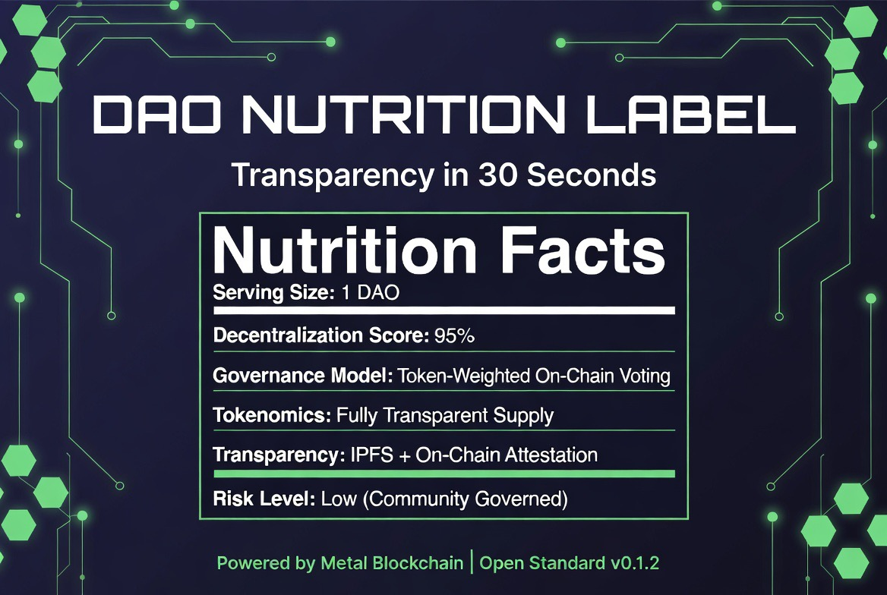

# DAO Nutrition Label



**The food nutrition label for DAOs — transparency in 30 seconds.**


[](https://creativecommons.org/licenses/by/4.0/)


**See a real label here → [Live IPFS Example](https://dweb.link/ipfs/bafybeifjpj2lqibtgmwv7u7e5lonzbriz2zq4wiyuyp267lelnbzohpvwm)**

---

An open-source, community-driven transparency profile standard for measuring decentralization for DAOs and Metal Blockchain ecosystem projects.

Built on the **OpenChain Profile Standard (OCPS v0.1.2)** with visual “nutrition label” summaries, IPFS pinning, and on-chain attestations.

---

## Features
- ✅ YAML + JSON + PDF profile formats  
- ✅ IPFS pinned transparency certificates  
- ✅ On-chain attestation on XPR Network  
- ✅ zk-DID extension for privacy-preserving compliance  
- ✅ Aligned with EIP-4824 for cross-chain discoverability  

---

## Standards Alignment
The DAO Nutrition Label focuses on **what** decentralization metrics matter.  
It builds on [EIP-4824](https://eips.ethereum.org/EIPS/eip-4824) (`dao://` URI scheme) and adds the missing visual + certification layer.

---

## How It Works (10-minute contribution)
1. Copy [`profiles/sample_dao.yaml`](./profiles/sample_dao.yaml)  
2. Rename it to your DAO name (e.g. `my-dao.yaml`)  
3. Fill in your details  
4. Open a Pull Request to the [`profiles/`](./profiles/) folder  

Every profile helps the entire Metal Blockchain community!

---

## DAO Profile Template
```yaml
dao_name: ExampleDAO
chain: Metal Blockchain (XPR Network)
version: v0.1.2
created: 2025-09-08
contributors:
  - name: Austin Auger
    role: Maintainer
governance:
  model: Token-weighted voting
  token: EXM
  supply: 1,000,000
  quorum: 15%
  voting_period: 7 days
transparency:
  ipfs_cid: bafkreicsmi3psin7klvrsarl36b3zoxlv2722ru3yhqzne2tmhc6fqss3u
  attestation_tx: 2d6b62ded2f59965a2ad911972291f60e453275dcab58c954f1f657ed1fda349
  attestor: austinauger
notes: >
  This is a sample DAO profile submission for contributors to copy and adapt.
